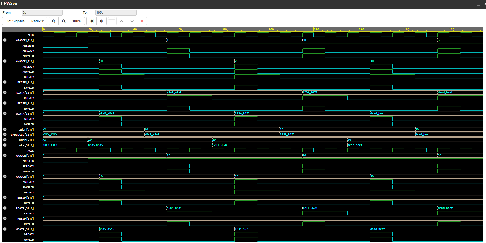

# AXI-Lite Slave Design & Verification

## Overview
This project implements and verifies an AXI-Lite slave using SystemVerilog.

AXI-Lite is a simplified version of the AXI protocol used for low-bandwidth, register-based communication in System-on-Chip (SoC) designs.

---

## Features
- AXI-Lite write transaction
- AXI-Lite read transaction
- Address-based memory access
- Ready/Valid handshake mechanism
- Write response channel (BRESP)
- Read response channel (RRESP)
- PASS/FAIL read validation
- Waveform-based protocol debugging

---

## Design (RTL)
The AXI-Lite slave is implemented using a memory array.  

- Write transactions store data into memory using `AWADDR` and `WDATA`  
- Read transactions return data using `ARADDR` and `RDATA`  
- Handshake follows VALID/READY protocol  

---

## AXI-Lite Channels

### Write Channels
- **AW (Address Write):** AWADDR, AWVALID, AWREADY  
- **W (Write Data):** WDATA, WVALID, WREADY  
- **B (Write Response):** BRESP, BVALID, BREADY  

### Read Channels
- **AR (Address Read):** ARADDR, ARVALID, ARREADY  
- **R (Read Data):** RDATA, RRESP, RVALID, RREADY  

---

## Verification
A SystemVerilog testbench is used to:

- Generate AXI-Lite write transactions  
- Generate AXI-Lite read transactions  
- Validate READY/VALID handshake behavior  
- Compare expected vs actual read data  
- Display PASS/FAIL results  
- Generate waveform output  

---

## Tools Used
- SystemVerilog  
- EDA Playground  
- Icarus Verilog  
- EPWave  

---

## Waveform

Below waveform shows AXI-Lite handshake signals and read/write transactions:

---

## Simulation Output
WRITE: Address=16 Data=a5a5a5a5
PASS READ: Address=16 Data=a5a5a5a5

WRITE: Address=32 Data=12345678
PASS READ: Address=32 Data=12345678

WRITE: Address=48 Data=deadbeef
PASS READ: Address=48 Data=deadbeef

AXI-Lite verification completed.

---

## Skills Demonstrated
- RTL Design using SystemVerilog  
- AXI-Lite Protocol Understanding  
- Ready/Valid Handshake Verification  
- Read/Write Transaction Verification  
- Testbench Development and Simulation  
- Debugging using Waveform Analysis (EPWave)  

---

## AXI-Lite Protocol Notes
- Write uses AW, W, and B channels  
- Read uses AR and R channels  
- Transfer occurs when VALID and READY are both high  
- BRESP/RRESP = `00` indicates OKAY response  

---

## How to Run
1. Open EDA Playground  
2. Load design.sv and testbench.sv into the editor  
3. Select Icarus Verilog  
4. Run simulation  
5. Open EPWave to view waveform  

---

## Author
**Subba Raju Sarikonda**  
RTL Design & Verification Engineer (SystemVerilog) Enthusiast.
